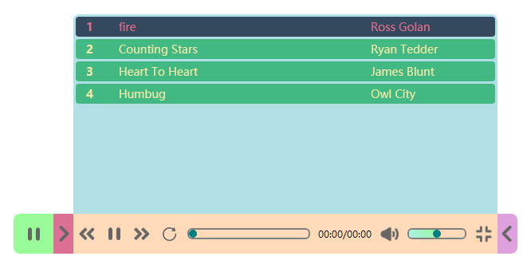
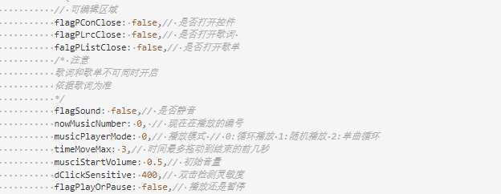
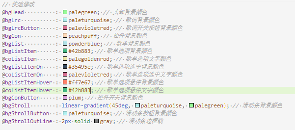

# Music-Player

**简洁音乐HTML播放器**

## 播放器特点

+ **播放器可以随意拖动**
+ **自动根据网页大小变换大小和位置**
+ **简单易用**
+ **全新界面设计**
+ **基于less ,Vue ,jQuery 修改简单**

## 播放器截图

### 控制界面

### 歌词

### 歌单

### 拖动

## 修改配置

+ ### 修改播放器设置

    #### 可在在 [musicPlayer.js](./script/musicPlayer.js) 中修改

    

+ ### 修改播放器样式

    #### 可在 [musicPlayer.less](./css/musicPlayer.less) 中修改

    

## 其它

### 此项目可以自行修改为Vue组件